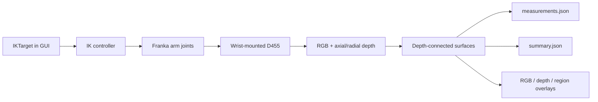

# Ridgeback + Franka Panda + D455 GUI Demo
| Complete simulated workspace and measurement targets. | D455 stereo camera mounted above the Panda hand. |
|---|---|
|  |  |


<p align="center">
  <strong>Drag an IK target, aim a wrist-mounted stereo camera, and capture auditable RGB + depth measurements in Isaac Sim.</strong>
</p>


## Demo result

| RGB: target ID and representative pixel | Depth: axial depth at the same pixel |
|---|---|
|  |  |

The included `2026-0730-1` reference capture reports eight visible targets from
near to far and excludes one detected floor region. The closest representative
surface is `0.594 m` from the camera; the wall surface is `3.370 m` away. The
capture completed with zero controller errors and left the USD unchanged.

[Open the compact result](outputs/captures/2026-0730-1/summary.json) ·
[Open the complete measurements](outputs/captures/2026-0730-1/measurements.json) ·
[Open capture provenance](outputs/captures/2026-0730-1/capture.json)

## What it demonstrates

- GUI manipulation of `/World/IKTarget` while simulation is running.
- Franka Panda inverse kinematics with a wrist-mounted Intel RealSense D455.
- Automatic capture IDs such as `2026-0730-1`, `2026-0730-2`, and so on.
- Left, right, and color RGB plus axial and radial depth arrays.
- Color-independent visible-surface grouping from depth discontinuities.
- Camera-space and world-space surface coordinates with near/median/far depth.
- Operator overlays that make every reported measurement visually auditable.

## What the D455 simulation represents

The wrist accessory is an Intel RealSense D455 geometry and camera model in
Isaac Sim. It contains separate left, right, and color camera prims and preserves
a measured left-to-right baseline of approximately `0.095 m`. The camera moves
with the Panda hand, so every capture records its runtime world position and its
right, up, and forward basis vectors.

This demo reads two RTX-rendered depth products from the left camera:

- `distance_to_image_plane` supplies axial depth along camera Z-forward and is
  saved as `depth_axial_left.npy`.
- `distance_to_camera` supplies radial range and is saved as
  `depth_radial_left.npy`.

The current pipeline therefore tests camera geometry, visibility, coordinate
conversion, and depth-surface reporting. It does **not** simulate the physical
D455 stereo-disparity algorithm, firmware processing, quantization, optical
noise, or material-dependent hardware failure modes. This distinction defines
which accuracy claims can be made from the reference capture.

## Requirements and installation

This release was tested in the Isaac Sim 6.0 GUI on Linux with an NVIDIA RTX
GPU. Install Isaac Sim using NVIDIA's
[Workstation Installation](https://docs.isaacsim.omniverse.nvidia.com/6.0.0/installation/install_workstation.html)
guide and run the supplied compatibility checker first. The scene references
Isaac Sim 6.0 assets, so allow asset access when opening it for the first time.

Clone the repository; no separate `pip install` is required because the scripts
run inside Isaac Sim and use its bundled Python packages and extensions.

```bash
git clone https://github.com/hayashimatsu/ridgeback-franka-d455-demo.git
cd ridgeback-franka-d455-demo
```

## Live GUI workflow

1. Open `scenes/ridgeback_franka_d455_demo.usd` in Isaac Sim.
2. Press **Play**.
3. Open `scripts/demo_start.py` in **Window > Script Editor** and press
   **Ctrl+Enter** once.
4. Select `/World/IKTarget` in the Stage tree. Move or rotate it in small,
   reachable increments and wait for the wrist camera to settle.
5. In the Script Editor console, capture the current view:

```python
demo_capture()
```

No filename is required and an earlier capture is never overwritten. An
optional note is supported when useful:

```python
demo_capture("front-inspection")
```

See [the demo runbook](docs/DEMO_RUNBOOK.md) for the complete operator checklist
and [the GUI object guide](docs/ADDING_OBJECTS_GUI.md) before adding scene or
wrist-mounted objects.

## System architecture



The RGB image labels each target as `T# (u,v)`. The depth image uses the same
representative pixel but displays `T# <depth> m`, where depth is axial camera
Z-forward distance. `summary.json` is a compact projection of the complete
`measurements.json`; it is not a second detector.

## Capture contents

```text
outputs/captures/<YYYY-MMDD-sequence>/
├── rgb_color.png, rgb_left.png, rgb_right.png
├── depth_axial_left.npy, depth_axial_right.npy
├── depth_radial_left.npy, depth_preview.png
├── depth_region_labels.npy
├── rgb_left_annotated.png
├── depth_preview_annotated.png
├── region_overlay.png
├── capture.json
├── measurements.json
└── summary.json
```

`measurements.json` records the left camera world pose, every visible surface's
camera/world coordinates, its image coverage, 3D visible bounds, and surface
depth distribution. Raw axial depth plus `depth_region_labels.npy` preserves
non-planar surface samples without embedding large point arrays in JSON. Known
floor regions remain available as raw evidence but are excluded from the target
list and operator overlays.

## Repository layout

```text
scenes/          Demo USD scene
scripts/         GUI bootstrap, IK controller, and D455 capture
docs/            Operator and object-maintenance guides
outputs/         One reviewed reference capture; new runtime captures are ignored
demo_manifest.yaml
```

## Measurement limits

### Coordinate and distance result

For capture `2026-0730-1`, the left camera world position is
`C_world = (0.657637, 0.360578, 1.171612) m`. Each reported target provides one
visible representative surface point in both camera coordinates
`S_camera = (x_right, y_up, z_forward)` and world coordinates `S_world`.
The two coordinate-frame expressions of the same range must satisfy:
<br>
```math
\Vert S_{\text{camera}} \Vert = \Vert S_{\text{world}} - C_{\text{world}} \Vert
```
<br>
The final column is the coordinate-frame closure error:

```math
e_{\text{closure}} = \left| \Vert S_{\text{camera}} \Vert - \Vert S_{\text{world}} - C_{\text{world}} \Vert \right|
```
<br>

| Target · post-detection GUI label | Pixel `(u,v)` | `S_camera` XYZ (m) | `S_world` XYZ (m) | Camera range (m) | World range (m) | Closure error (mm) |
|---|---:|---|---|---:|---:|---:|
| T1 · `phase5_sphere_00_red` | `(574,401)` | `(0.351, -0.222, 0.425)` | `(1.080, 0.012, 0.942)` | 0.594338 | 0.594338 | 0.000016 |
| T2 · `phase5_cube_01_springgreen` | `(358,288)` | `(0.076, -0.096, 0.617)` | `(1.273, 0.288, 1.063)` | 0.628880 | 0.628880 | 0.000005 |
| T3 · `phase5_sphere_02_rose` | `(471,190)` | `(0.437, 0.145, 0.890)` | `(1.553, -0.071, 1.300)` | 1.002391 | 1.002391 | 0.000006 |
| T4 · `phase5_cube_03_yellow` | `(300,358)` | `(-0.081, -0.480, 1.252)` | `(1.899, 0.448, 0.667)` | 1.343311 | 1.343311 | 0.000010 |
| T5 · `phase5_sphere_04_azure` | `(406,366)` | `(0.538, -0.788, 1.926)` | `(2.570, -0.168, 0.346)` | 2.149148 | 2.149148 | 0.000040 |
| T6 · `phase5_cube_05_violet` | `(80,115)` | `(-1.573, 0.819, 2.017)` | `(2.681, 1.947, 1.947)` | 2.685410 | 2.685410 | 0.000039 |
| T7 · `phase5_sphere_06_chartreuse` | `(332,100)` | `(0.108, 1.265, 2.781)` | `(3.463, 0.272, 2.381)` | 3.056607 | 3.056607 | 0.000032 |
| T8 · `wall` | `(285,197)` | `(-0.377, 0.463, 3.317)` | `(3.981, 0.758, 1.568)` | 3.370186 | 3.370186 | 0.000023 |

The maximum closure error is approximately `0.000040 mm`. This demonstrates
numerical consistency between camera-space back-projection and runtime
camera-to-world transformation. It is **not** a physical D455 depth-accuracy
measurement. Target names in the table are attached only after depth detection
for GUI checking; they do not participate in detection.

### What is measured—and what is not

- Axial depth is the representative pixel's Z-forward value. It is not the
  oblique three-dimensional range unless the pixel lies on the optical axis.
- Camera-to-surface range is the Euclidean distance to one visible surface
  sample, never a distance to the hidden object center.
- `surface_point_to_authored_center_m` is not sensor error. It includes sphere
  radius or cube half-size, viewing direction, and representative-point
  selection. A wall representative point is especially unsuitable for a
  comparison with the center of the entire wall.
- A true simulated surface-accuracy test would cast the representative camera
  ray against the authored USD geometry and compare RTX depth with that visible
  surface intersection. That independent surface oracle is not part of the
  current release report.

Depth discontinuities identify visible surface regions, not semantic object
identity. Touching objects at nearly identical depth can merge, while one
occluded object can split into multiple regions. Reflective, transparent, or
invalid-depth surfaces require a different sensor or material-error strategy.
The reported representative point is a repeatable visible surface sample, never
an inferred hidden object center.
