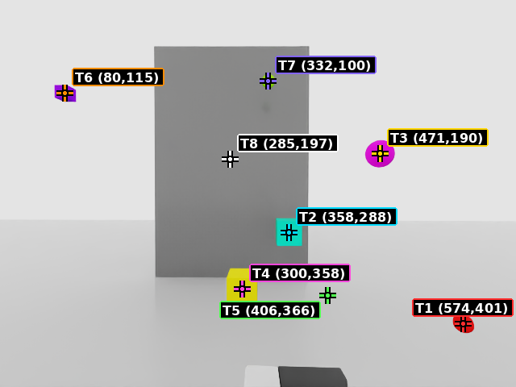
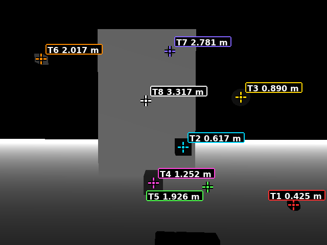
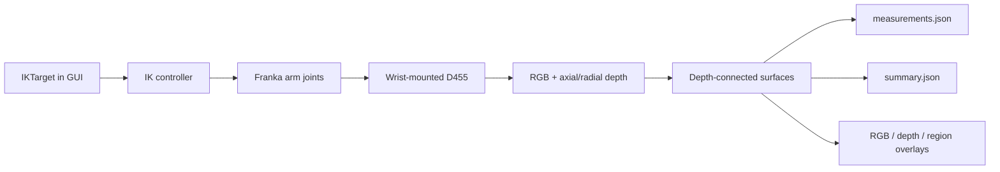

# Ridgeback + Franka Panda + D455 GUI Demo

<p align="center">
  
</p>

<p align="center">
  <strong>Drag an IK target, aim a wrist-mounted stereo camera, and capture auditable RGB + depth measurements in Isaac Sim.</strong>
</p>

<p align="center">
  
  
  
</p>

## Demo result

| RGB: target ID and representative pixel | Depth: axial depth at the same pixel |
|---|---|
|  |  |

The included `2026-0730-1` reference capture reports eight visible targets from
near to far and excludes one detected floor region. The closest representative
surface is `0.594 m` from the camera; the wall surface is `3.370 m` away. The
capture completed with zero controller errors and left the USD unchanged.

[Open the compact result](outputs/captures/2026-0730-1/summary.json) ·
[Open the complete measurements](outputs/captures/2026-0730-1/measurements.json) ·
[Open capture provenance](outputs/captures/2026-0730-1/capture.json)

## What it demonstrates

- GUI manipulation of `/World/IKTarget` while simulation is running.
- Franka Panda inverse kinematics with a wrist-mounted Intel RealSense D455.
- Automatic capture IDs such as `2026-0730-1`, `2026-0730-2`, and so on.
- Left, right, and color RGB plus axial and radial depth arrays.
- Color-independent visible-surface grouping from depth discontinuities.
- Camera-space and world-space surface coordinates with near/median/far depth.
- Operator overlays that make every reported measurement visually auditable.

## Requirements and installation

This release was tested in the Isaac Sim 6.0 GUI on Linux with an NVIDIA RTX
GPU. Install Isaac Sim using NVIDIA's
[Workstation Installation](https://docs.isaacsim.omniverse.nvidia.com/6.0.0/installation/install_workstation.html)
guide and run the supplied compatibility checker first. The scene references
Isaac Sim 6.0 assets, so allow asset access when opening it for the first time.

Clone the repository; no separate `pip install` is required because the scripts
run inside Isaac Sim and use its bundled Python packages and extensions.

```bash
git clone https://github.com/hayashimatsu/ridgeback-franka-d455-demo.git
cd ridgeback-franka-d455-demo
```

## Live GUI workflow

1. Open `scenes/ridgeback_franka_d455_demo.usd` in Isaac Sim.
2. Press **Play**.
3. Open `scripts/demo_start.py` in **Window > Script Editor** and press
   **Ctrl+Enter** once.
4. Select `/World/IKTarget` in the Stage tree. Move or rotate it in small,
   reachable increments and wait for the wrist camera to settle.
5. In the Script Editor console, capture the current view:

```python
demo_capture()
```

No filename is required and an earlier capture is never overwritten. An
optional note is supported when useful:

```python
demo_capture("front-inspection")
```

See [the demo runbook](docs/DEMO_RUNBOOK.md) for the complete operator checklist
and [the GUI object guide](docs/ADDING_OBJECTS_GUI.md) before adding scene or
wrist-mounted objects.

## System architecture



The RGB image labels each target as `T# (u,v)`. The depth image uses the same
representative pixel but displays `T# <depth> m`, where depth is axial camera
Z-forward distance. `summary.json` is a compact projection of the complete
`measurements.json`; it is not a second detector.

## Capture contents

```text
outputs/captures/<YYYY-MMDD-sequence>/
├── rgb_color.png, rgb_left.png, rgb_right.png
├── depth_axial_left.npy, depth_axial_right.npy
├── depth_radial_left.npy, depth_preview.png
├── depth_region_labels.npy
├── rgb_left_annotated.png
├── depth_preview_annotated.png
├── region_overlay.png
├── capture.json
├── measurements.json
└── summary.json
```

`measurements.json` records the left camera world pose, every visible surface's
camera/world coordinates, its image coverage, 3D visible bounds, and surface
depth distribution. Raw axial depth plus `depth_region_labels.npy` preserves
non-planar surface samples without embedding large point arrays in JSON. Known
floor regions remain available as raw evidence but are excluded from the target
list and operator overlays.

## Repository layout

```text
scenes/          Demo USD scene
scripts/         GUI bootstrap, IK controller, and D455 capture
docs/            Operator and object-maintenance guides
outputs/         One reviewed reference capture; new runtime captures are ignored
demo_manifest.yaml
```

## Measurement limits

Depth discontinuities identify visible surface regions, not semantic object
identity. Touching objects at nearly identical depth can merge, and reflective,
transparent, or invalid-depth surfaces require a different sensor strategy.
The reported representative point is a visible surface sample, never an inferred
hidden object center.
